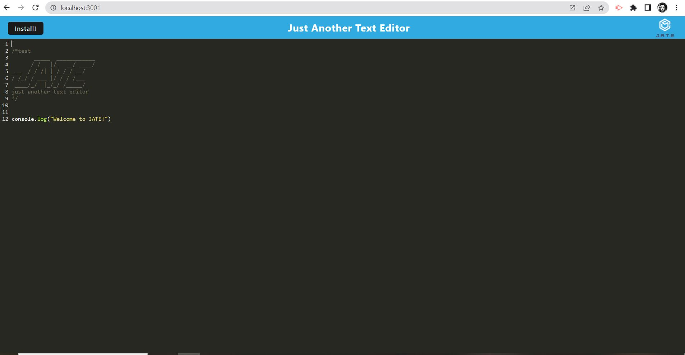

# Text Edit

## _Table Of Contents_

1. [Description](#description)
2. [Usage](#usage)
3. [Installation](#installation)
4. [License](#license)
5. [Criteria For Assignment](#criteria-for-assignment)
6. [Repo Link](#repository-link)
7. [Deployed Website](#deployed-website)
8. [Screen Shots](#screen-shots)

## Description

For this assignment I was given some starter code for a installable text edit application that can be used to write test code. This assignment was to help finish creating and deployed a text editor that can be used on and offline by the user. The user will be able to write code in a text editor in their browser that will also be saved to the page if they reloaded it. The user can also install the application so it could be used offline as well.

## Usage

The user will be able to access the website and download an offline version. This application is a text editor that can be used to write test code in. The application can be installed on your local drive to use offline.

## Installation

You will need to start by installing the npm packages for the webpack configurations.

## License

MIT

_Website for license_

[MIT License Website](https://mit-license.org/)

## Criteria-for-assignment

GIVEN a text editor web application

<!-- good -->
**WHEN I open my application in my editor**
*THEN I should see a client server folder structure*

<!-- good -->
**WHEN I run `npm run start` from the root directory**
*THEN I find that my application should start up the backend and serve the client* 

<!-- good -->
**WHEN I run the text editor application from my terminal**
*THEN I find that my JavaScript files have been bundled using webpack*

<!-- good -->
**WHEN I run my webpack plugins**
*THEN I find that I have a generated HTML file, service worker, and a manifest file*

<!-- good -->
**WHEN I use next-gen JavaScript in my application**
*THEN I find that the text editor still functions in the browser without errors*

<!--good-->
**WHEN I open the text editor**
*THEN I find that IndexedDB has immediately created a database storage*

<!-- need -->
**WHEN I enter content and subsequently click off of the DOM window**
*THEN I find that the content in the text editor has been saved with IndexedDB*

<!-- good -->
**WHEN I reopen the text editor after closing it**
*THEN I find that the content in the text editor has been retrieved from our IndexedDB*

<!-- need ? install button works but need local open  -->
**WHEN I click on the Install button**
*THEN I download my web application as an icon on my desktop*

<!-- need? -->
**WHEN I load my web application**
*THEN I should have a registered service worker using workbox*

<!-- need? -->
**WHEN I register a service worker**
*THEN I should have my static assets pre cached upon loading along with subsequent pages and static assets*

<!-- need -->
**WHEN I deploy to Heroku**
*THEN I should have proper build scripts for a webpack application*

## Repository-Link

[Github](https://github.com/PintoDrop/textedit)

## Deployed-Website

[Deployed Website]()

## Screen-Shots

<!-- 
need to add to src/js/database & install
might need work on the service worker code (src-sw.js)
 -->